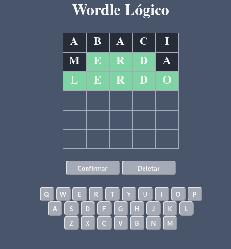
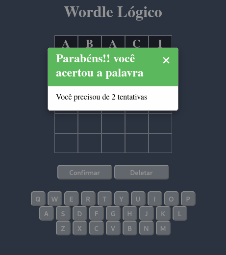

# WORDLE Game

**Disciplina**: FGA0210 - PARADIGMAS DE PROGRAMAÇÃO - T01 <br>
**Nro do Grupo**: 01<br>
**Paradigma**: Lógico<br>

## Alunos
|Matrícula | Aluno |
| -- | -- |
| 18/0138596  | Tomás Veloso Peixoto Matutino  | 
| 18/0100840  | Gabriel Azevedo Batalha        |
| 18/0054082  | Marcelo Victor de Sousa Silva  |
| 17/0115208  | Victor Levi Peixoto            | 
| 17/0013812  | João Matheus de Sousa Rodrigues| 
| 16/0049733  | Felipe Borges de Souza Chaves  | 
| 15/0058462  | Davi Antônio da Silva Santos   | 

## Sobre 
Este projeto toma como base um jogo que tem se tornado muito popular na internet, o WORDLE que consiste em um jogo de palavras que tem como objetivo encontrar uma palavra a partir de chutes com palavras do mesmo tamanho e dicas que o próprio jogo oferece. 

## Screenshots





Adicione 2 ou mais screenshots do projeto em termos de interface e/ou funcionamento.

## Instalação 
**Linguagens**: Prolog<br>
**Tecnologias**: <br>

Para instalar o programa você precisa inicialmente [instalar o prolog na sua máquina](https://www.swi-prolog.org/Download.html).

Com o programa instalado rode o arquivo server.pl e visite essa [página](http://localhost:8000/game).

### Usando docker-compose

Uma forma fácil de testar o projeto é utilizando [docker-compose](https://docs.docker.com/compose/install/).
Para isso apenas use o comando abaixo

```bash
 sudo docker-compose wordle
```

## Uso 

A página representa um jogo de Wordle. No inicio do jogo é escolhido uma palavra randomica retirada do arquivos **words.pl**.
A partir disso o jogador tem algumas chances para adivinhar essa palavra usando outras palavras do dicionário **words.pl**.

Assim que uma palavra inserida ela é avaliada em relação a palavra escondida e todos os caracteres que estão na mesma posição 
na palavra misteriosa ficarão na cor verde. Aqueles que estão na palavra escondida mas não naquela localidade recebem a coloração
amarela. Caso não esteja na palavra misteriosa a cor será cinza.

## Vídeo

[Playlist](https://www.youtube.com/watch?v=zV4PXIWmV3U&list=PL1i0a-GpsR8W1W2XJWiHRGVJQ_TqEnrn-)

## Outros 

Para criar o jogo codificamos um servidor prolog para a lógica do jogo.

Toda o html renderizado é feito de forma estática e existe scripts JQuery e Ajax 
que dão suporte para as interações do usuário.

## Fontes

Os arquivos `pt_BR.dic` e `pt_BR.aff` possuem licença MPLv2 (Mozilla Public
License v2.0)ou LGPLv3 (Lesser General GNU Public License v3.0) e foram
escritos por Raimundo Santos Moura de 2006 a 2013. Ambos foram extraídos do
pacote VERO (Verificador Ortográfico da Língua Portuguesa) do LibreOffice,
versão 3.2.15.

O pacote achava-se disponível na data de 11 de março de 2022 no
[link](https://pt-br.libreoffice.org/assets/Uploads/PT-BR-Documents/VERO/VeroptBR3215AOC.oxt)

[Tutorial — Creating Web Applications in SWI-Prolog](https://github.com/Anniepoo/swiplwebtut/blob/master/web.adoc#introduction)

